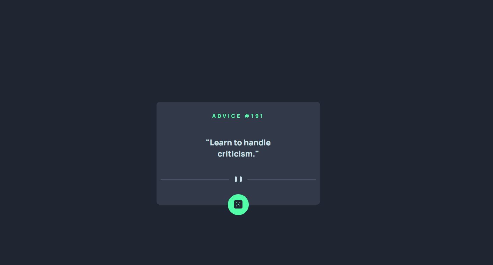

# APP de gerador de conselho

## Desafio
Desafio foi construir um aplicativo web que faz uma comunicação com Advice Slip API ao clicar no botão, retornando algum conselho aleatório.

---

## Funcionalidade
[]

----

## Tecnologias utilizadas
- HTML
- CSS
- JavaScript
- Integração com API
- Git